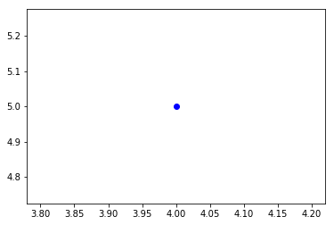
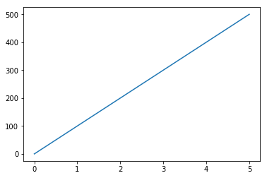
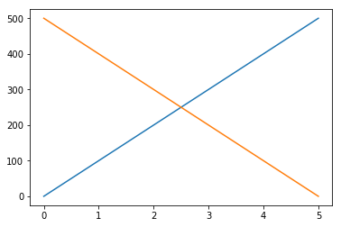

# Plotting using `matplotlib` 
This module will cover plotting basics using the `matplotlib.pyplot` API and plotting with pandas data frames.

The Jupyter Notebook will render plots inline if we ask it to using a “magic” command `%matplotlib`.
```python
import matplotlib.pyplot as plt
import pandas as pd
%matplotlib inline
```
## Let's create a fake data frame that we will use to explore the plotting functions.

```python
df1 = pd.DataFrame({'time': [0, 1, 2, 3, 4, 5],
                    'distance': [0, 100, 200, 300, 400, 500]},
                  index=[0, 1, 2, 3, 4, 5])

df2 = pd.DataFrame({'time': [0, 1, 2, 3, 4, 5],
                    'distance': [500, 400, 300, 200, 100, 0]},
                    index=[0, 1, 2, 3, 4, 5])
```

Plots from data frames are then (fairly) simple to create.
`plt.plot()` provides us with a canvas that we can begin adding to!
```python
plt.plot()
plt.plot?
```
At the minimum you need to fill in some of the parameters that correspond to `plt.plot`, like `x` and `y`, and the line style or marker.
```python
plt.plot(4,5, marker = 'o')
```

## Working with pandas data frames
`matplotlib.pyplot` can handle pandas data frames directly.

You can use indexing by name directly.
```python
plt.plot(df1['time'],df1['distance'])
```


or
```python
plt.plot('time', 'distance', data= df1)
```


You can add multiple plots by adding more `plt.plot()` 
```python
plt.plot('time', 'distance', data= df1)
plt.plot('time', 'distance', data= df2)
```
