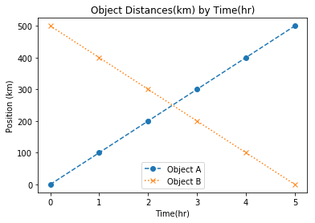
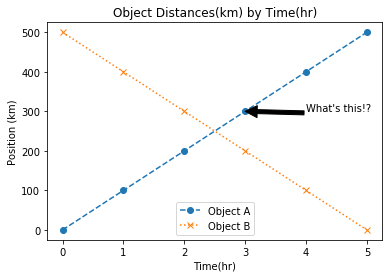

# Adding Meaning to Plots
Let's load our libraries and use our previous fake data.
```python
import matplotlib.pyplot as plt
import pandas as pd
%matplotlib inline

df1 = pd.DataFrame({'time': [0, 1, 2, 3, 4, 5],
                    'distance': [0, 100, 200, 300, 400, 500]},
                  index=[0, 1, 2, 3, 4, 5])

df2 = pd.DataFrame({'time': [0, 1, 2, 3, 4, 5],
                    'distance': [500, 400, 300, 200, 100, 0]},
                    index=[0, 1, 2, 3, 4, 5])
```
Start with our canvas using the two data frames.
```python
plt.plot('time', 'distance', data= df1)
plt.plot('time', 'distance', data= df2)
```

### We can set some parameters for each graph, refer to `plt.plot?` for specifics.  For this example we will set the `marker`and `linestyle`.
```python
plt.plot('time', 'distance', data= df1, marker='o', linestyle= 'dashed')
plt.plot('time', 'distance', data= df2, marker= 'x', linestyle= 'dotted')
```


### Exercise
check the `plt.plot` documentation and change the colors of these two plots.
### *Solution*
```python
plt.plot('time', 'distance', data= df1, marker='o', linestyle= 'dashed', color='r')
plt.plot('time', 'distance', data= df2, marker= 'x', linestyle= 'dotted', color='b')
```

## Plot axis labels
We can set our axes labels directly using `plt.xlabel` and `plt.ylabel`.
```python
plt.plot('time', 'distance', data = df1, marker= 'o', linestyle= 'dashed')
plt.plot('time', 'distance', data = df2, marker= 'o', linestyle= 'dashed')
plt.xlabel('Time (hr)')
plt.ylabel('Distance (km)')
```

We can add a title using `plt.title`.
```python
plt.plot('time', 'distance', data = df1, marker= 'o', linestyle= 'dashed')
plt.plot('time', 'distance', data = df2, marker= 'o', linestyle= 'dashed')
plt.xlabel('Time (hr)')
plt.ylabel('Distance (km)')
plt.title('Object Distances(km) by Time(hr)')
```
we can add a legend by adding `label` to our plots and `plt.legend`.
```python
plt.plot('time', 'distance', data=df1, marker = 'o', linestyle = 'dashed', label = 'Object A')
plt.plot('time', 'distance', data=df2, marker = 'x', linestyle = 'dotted', label = 'Object B')
plt.xlabel('Time(hr)')
plt.ylabel('Position (km)')
plt.title('Object Distances(km) by Time(hr)')
plt.legend(loc='lower center')
```


If we wanted to annotate our plot we can use `plt.annotate`.
```python
plt.plot('time', 'distance', data=df1, marker = 'o', linestyle = 'dashed', label = 'Object A')
plt.plot('time', 'distance', data=df2, marker = 'x', linestyle = 'dotted', label = 'Object B')
plt.title('Object Distances(km) by Time(hr)')
plt.xlabel('Time(hr)')
plt.ylabel('Position (km)')
plt.legend(loc='lower center')
plt.annotate("What's this!?", xy=(3, 300), xytext=(3+1, 300+1), arrowprops=dict(facecolor='black'))
```
