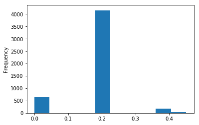
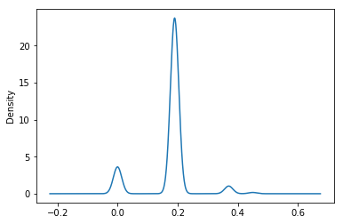
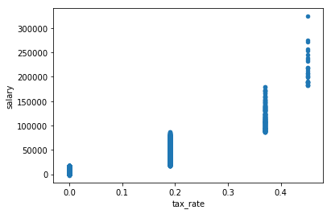
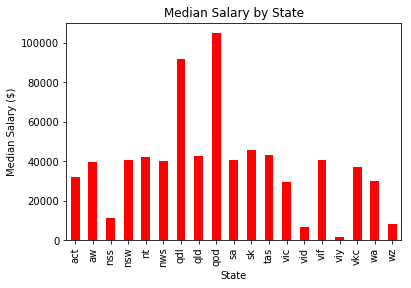

# Plot data directly from a `Pandas dataframe`.
```python
import pandas as pd
```
```python
df3 = pandas.read_csv('https://raw.githubusercontent.com/uwescience/ds4ad/master/data/synthetic_data.csv',index_col='rec_id')
print(df3.describe())
```
Often times you want to look at column distributions and behavior visually.  Using `pandas.DataFrame.plot()` directly facilitates that and uses `matplotlib/pyplot`.

You can access data frame columns directly like before in `pandas` notation followed by the `.plot`. 

You set the kind of plot you want by setting the `kind` parameter accordingly. 

This gives us a histogram of the column `salary`.
```python
df3["salary"].plot(kind='hist')
```


This gives us a histogram of the column `tax_rate`.
```python
df3["tax_rate"].plot(kind='hist')
```
You can get boxplots by setting the `kind` parameter to 'box'. 
```python
df3['salary'].plot(kind = 'box')
```


### Exercise:
Plot the density of the column 'tax_rate'. 

Hint: Look at the pandas.DataFrame.plot documentation for reference. 
### Solution
```python
df3['tax_rate'].plot(kind = 'density')
```


You can plot multiple columns by specifying them inside `.plot`.
```python
df3.plot('tax_rate','salary', kind = 'scatter')
```


## Plotting grouped data frame calculations
Often times you will summarize your data in a variety of ways and will want to represent that information visually.
```python
state_tax_mean = df3.groupby(['state'])['tax_rate'].mean()
```
This returns a series, and a series can be directly used with `.plot`.
```python
state_tax_mean.plot(kind='bar', color='r')
plt.title('Average Tax Rate by State')
plt.xlabel('State')
plt.ylabel('Average Tax Rate')
```


### Exercise
Calculate the median salary by state and create a plot with all the appropriate labels.
### Solution
```python
state_md_salary = df3.groupby(['state'])['salary'].median()
state_md.plot(kind='bar', color='r')
plt.title('Median Salary by State')
plt.xlabel('State')
plt.ylabel('Median Salary ($)')
```
